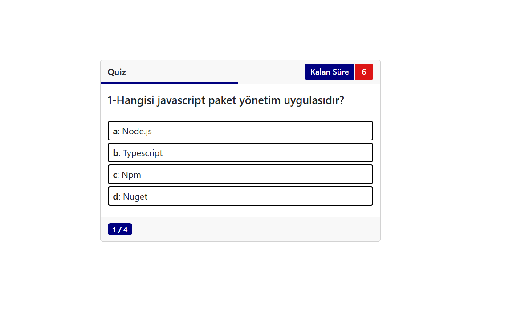
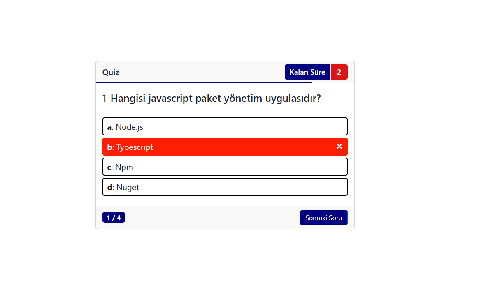
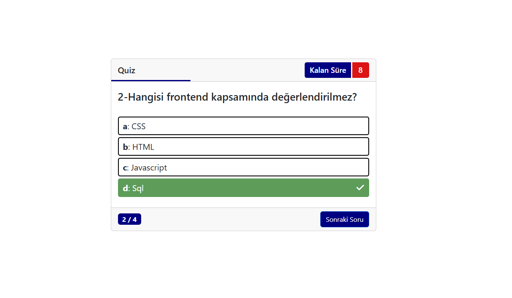
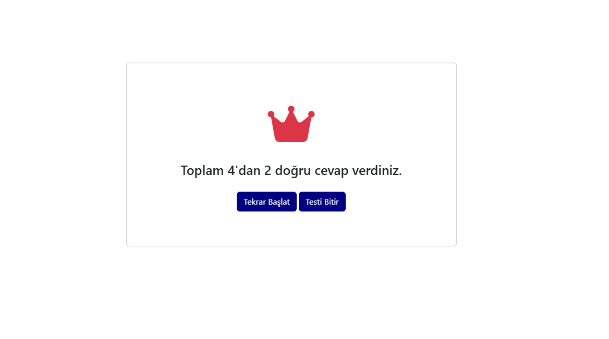

# ❓ Quiz App

A simple **JavaScript quiz application** that allows users to answer multiple-choice questions and see their final score.

## 🚀 Features

- Multiple choice questions
- Instant feedback for answers
- Score calculation
- Question navigation
- Interactive UI

## 🛠️ Technologies Used

- HTML
- CSS
- JavaScript

## 📂 Project Structure

```
QuizApp
 ├── images/
 ├── index.html
 ├── style.css
 ├── quiz.js
 ├── script.js
 ├── soru.js
 └── ui.js
```

## ⚙️ Installation

Clone the repository

```
git clone https://github.com/velidogan120/QuizApp.git
```

Open `index.html` in your browser.

## 🎯 Purpose

This project was created to practice:

- JavaScript logic building
- DOM manipulation
- Handling user input
- UI interaction

## 📸 Screenshots

<p>
  
  
  
  
  
</p>

## 👨‍💻 Author

Veli Doğan
https://github.com/velidogan120
